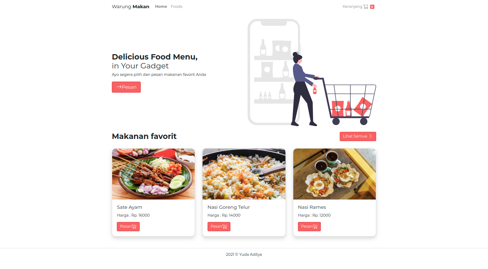
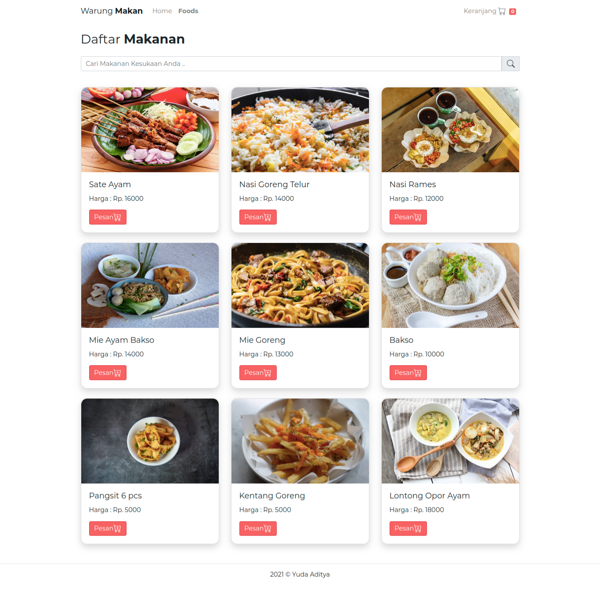
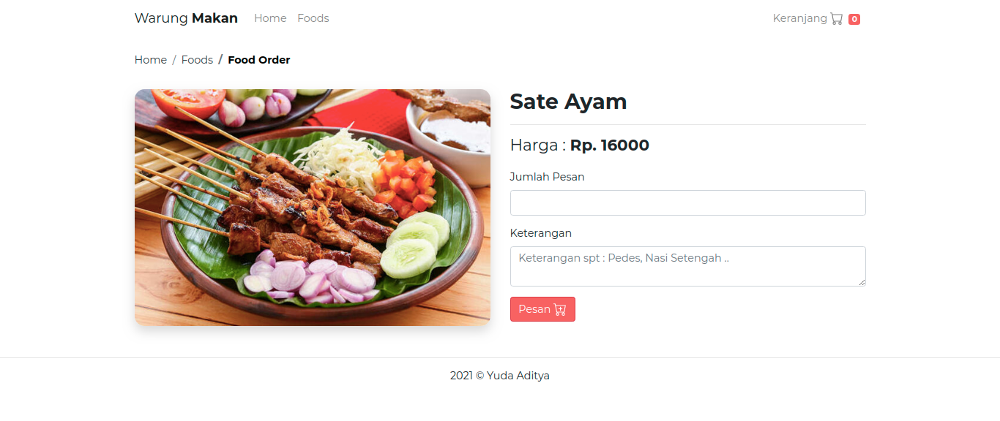
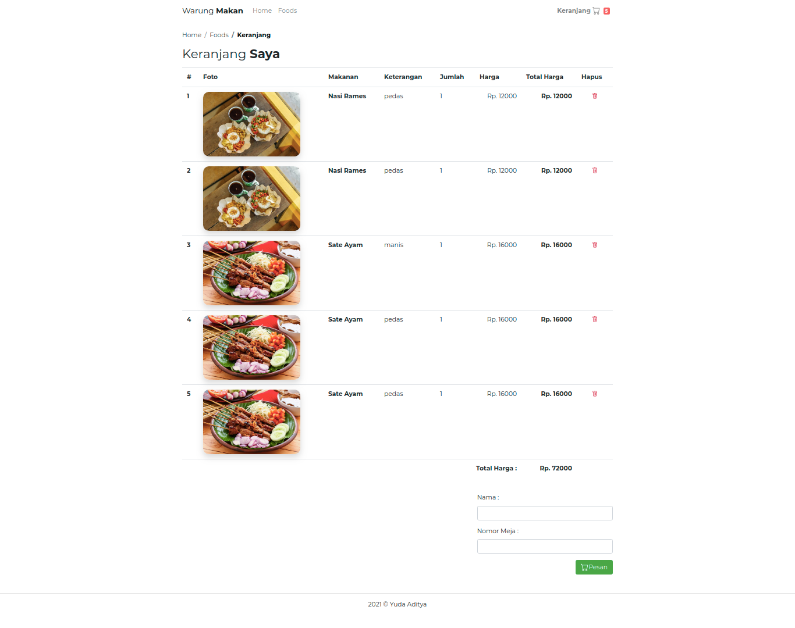

## SIMPLE CASHIER WEB APPS

### STACK

1. MONGO DB
2. EXPRESS JS
3. VUE JS
4. NODE JS
5. BOOTSRAP VUE

# WARUNG MAKAN APP

## Set Path to where File is Located (using cd).
```
cd warung-makan-client
```
```
cd warung-makan-api
```
## Project setup
```
npm install
```

### Compiles and hot-reloads for development Client
```
npm run serve
```

### Running Server
```
npm start
```

### Compiles and minifies for production
```
npm run build
```

### Lints and fixes files
```
npm run lint
```

### Customize configuration
See [Configuration Reference](https://cli.vuejs.org/config/).

### PREVIEW

### LANDING PAGE



### LIST FOODS



### FOODS DETAIL



### CART

